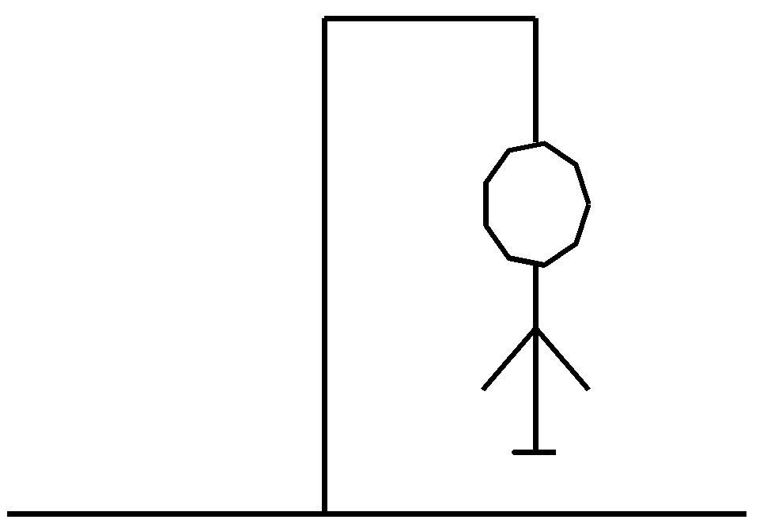

# Hangman_game_with_R

Hangman is a classic word game in which you need to need to guess as many possible letters in word, so you can guess the word, before running out of tries (lives).

Upon running out of tries, you are hanged!

## R code

R code consists of couple helper functions and data.frame dataset for drawing the hangman using ggplot.



Once you start the while loop, you will be prompted to insert the word that will be 
shown as "_ , _ , _ , _ " (in case of four-letter word) and later a  separate letter for guessing.


## Cloning the repository
You can follow the steps below to clone the repository. 
```
git clone -n https://github.com/tomaztk/Hangman_game_with_R
```


## License
These samples and templates are all licensed under the MIT license.

## Questions
Email questions to: tomaztsql@gmail.com